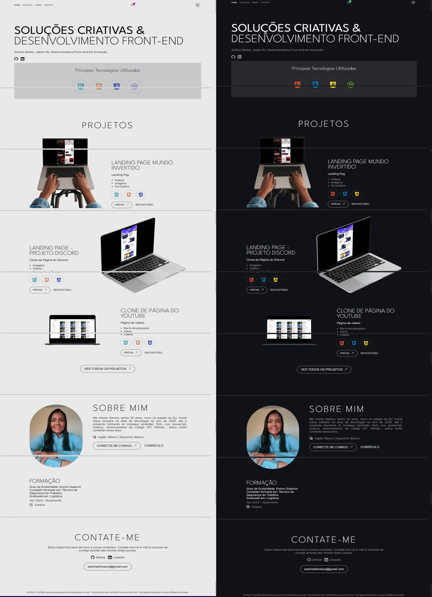
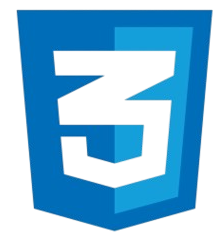
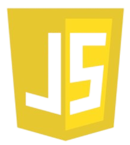

---

# 🎨 Portfólio | Front-End Developer 💻

Este projeto é um portfólio pessoal desenvolvido para apresentar meus projetos, habilidades técnicas e formas de contato. A proposta é manter um layout moderno, responsivo e com modo claro/escuro. 🌗

---

## 🧩 Funcionalidades

- 🎨 Tema dinâmico: claro e escuro com alternância por ícone.
- 💡 Seções intuitivas: Home, Projetos, Sobre e Contato.
- 📱 Responsivo para desktop e dispositivos móveis.
- 🛠️ Ícones interativos e transições suaves com CSS.

---

## 📸 Imagens do Projeto

### 🖥️ Desktop

## 🚀 Tecnologias Utilizadas

O projeto foi desenvolvido com as seguintes tecnologias:

-  **HTML5**
-  **CSS3**
-  **JavaScript**

---

## 🔗 Acesse o Projeto

- 💾 [Repositório no GitHub](https://github.com/samirasfonseca/PORTIFOLIO)

---

## 📫 Contato

 
- 🌍 [LinkedIn](https://www.linkedin.com/in/samira-santos-92364911a/)  
- 💻 [GitHub](https://github.com/samirasfonseca)

---

## 🧪 Créditos

Este projeto foi desenvolvido durante o **Lab: Construindo seu Portfólio Front-End do Zero** da [DIO](https://dio.me) com mentoria de [Elidiana Andrade](https://github.com/elidianaandrade).  
